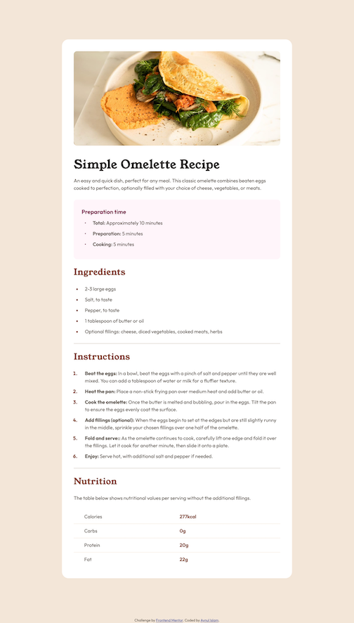
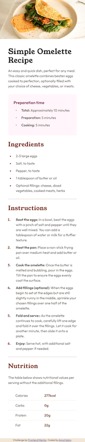

# Frontend Mentor - Recipe page solution

This is a solution to the [Recipe page challenge on Frontend Mentor](https://www.frontendmentor.io/challenges/recipe-page-KiTsR8QQKm). Frontend Mentor challenges help you improve your coding skills by building realistic projects. 

## Table of contents

- [Overview](#overview)
  - [The challenge](#the-challenge)
  - [Screenshot](#screenshot)
  - [Links](#links)
- [My process](#my-process)
  - [Built with](#built-with)
  - [What I learned](#what-i-learned)
  - [Continued development](#continued-development)
  - [Useful resources](#useful-resources)
- [Author](#author)
- [Acknowledgments](#acknowledgments)

## Overview

### Screenshot

### Links

- Solution URL: [Solution URL of Recipe page here](https://github.com/nayan041/recipe-page.git)
- Live Site URL: [Live site URL of Recipe page here](https://nayan041.github.io/recipe-page/)

## My process

### Built with

- Semantic HTML5 markup
- CSS custom properties
- List-styling in CSS

### What I learned

- The pseudo element `::marker` is new to me. For styling bullet points or serial numbers color, I get familiar with this element.
- The way of increasing  gap between list-text and bullet point or serial numbers.
- The usage procedure of media queries and table borders.
- The horizontal ruling style.
- Margin and Padding related settings. When Padding is applied to the parent element, content takes 100% width of parent element available after padding space is locked. But if padding is applied to the child element, `border-radius` property does not work for child. Again, if margin is applied for child element, it will overflow the parent container.
- The `padding-left` property for `ul/ol`  and for `li` does not do the same thing.
- Selecting `table` element related elements using `:first-child/ :last-child` use-cases.

### Continued development

- I want to learn how to align smaller sized (than text itself) bullet points with list-text as vertically to centre. 

### Useful resources

[Jonas’ Course on Udemy regarding  HTML and CSS](https://www.udemy.com/course/design-and-develop-a-killer-website-with-html5-and-css3/?couponCode=ST22MT92324A) - This website helped me for growing confidence on Card building.

## Author

- Frontend Mentor - [@nayan041](https://www.frontendmentor.io/profile/nayan041)

## Acknowledgments
 - Frontend Mentor
 - MDN
